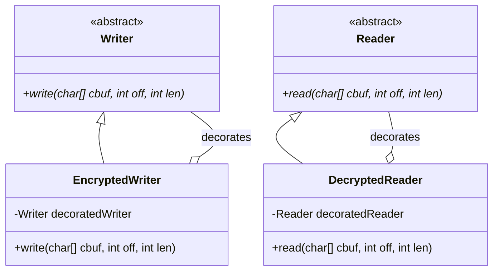

# Exercise 1: Decorator Pattern

## 1. Design Pattern Suitable
The **Decorator Pattern** is the most suitable solution for this situation. 

### Why?
The Decorator pattern allows adding new responsibilities (encryption/decryption) to objects dynamically without modifying the original code of the classes (`Writer`/`Reader`). It provides a flexible alternative to subclassing for extending functionality.

## 2. UML Class Diagram & Correspondence

### UML Diagram (Mermaid)


### Correspondence Table
| Pattern Element | Exercise 1 Element |
| :--- | :--- |
| **Component** | `java.io.Writer` / `java.io.Reader` |
| **ConcreteComponent** | `FileWriter`, `FileReader`, `StringWriter`, etc. |
| **Decorator** | `EncryptedWriter` / `DecryptedReader` |
| **Operation()** | `write()` / `read()` |

---

## 3. Implementation
The solution implements a simple Caesar cipher (character shift) by wrapping existing `Writer` and `Reader` instances.

### How to Run
```bash
cd Ex1
mvn clean compile
mvn exec:java -Dexec.mainClass="com.esi.designpatterns.Main"
```
