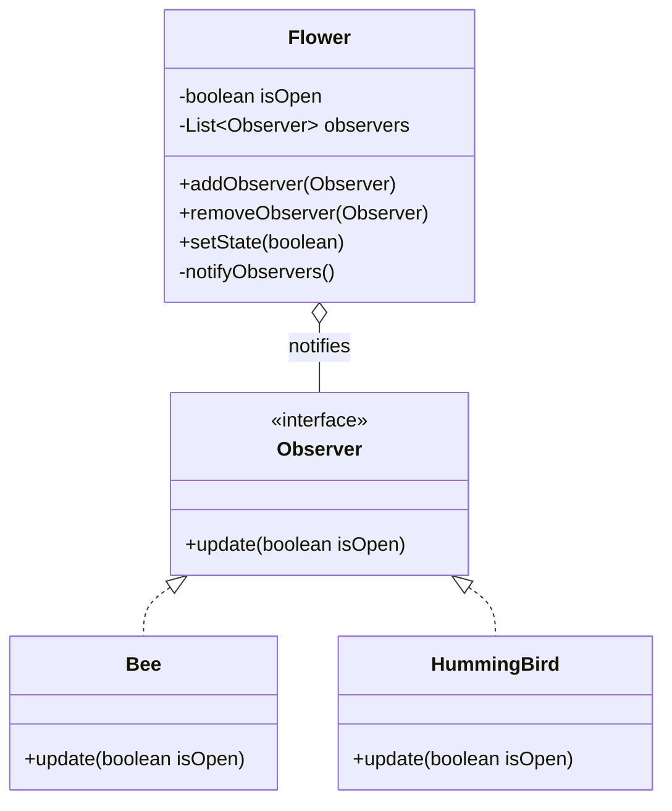

# Exercise 1: Flower Observation System

## 1. Design Pattern(s) Used
I used the **Observer Pattern**.

### Justification
The problem requires multiple independent entities (`Bee`, `HummingBird`) to react to state changes in another object (`Flower`). 
- **Decoupling**: The `Flower` doesn't need to know the specific types of creatures observing it; it just knows they implement the `Observer` interface.
- **Dynamic Updates**: Observers can be added or removed at runtime.
- **Push Model**: The `Flower` pushes state updates to all subscribed observers as soon as its state changes.

## 2. UML Class Diagram (Mermaid)


---

## 3. Implementation
The solution defines a clear separation between the **Subject** (`Flower`) and the **Observers** (`Bee`, `HummingBird`).

### How to Run
```bash
javac -d target/classes src/main/java/com/esi/designpatterns/*.java
java -cp target/classes com.esi.designpatterns.Main
```
