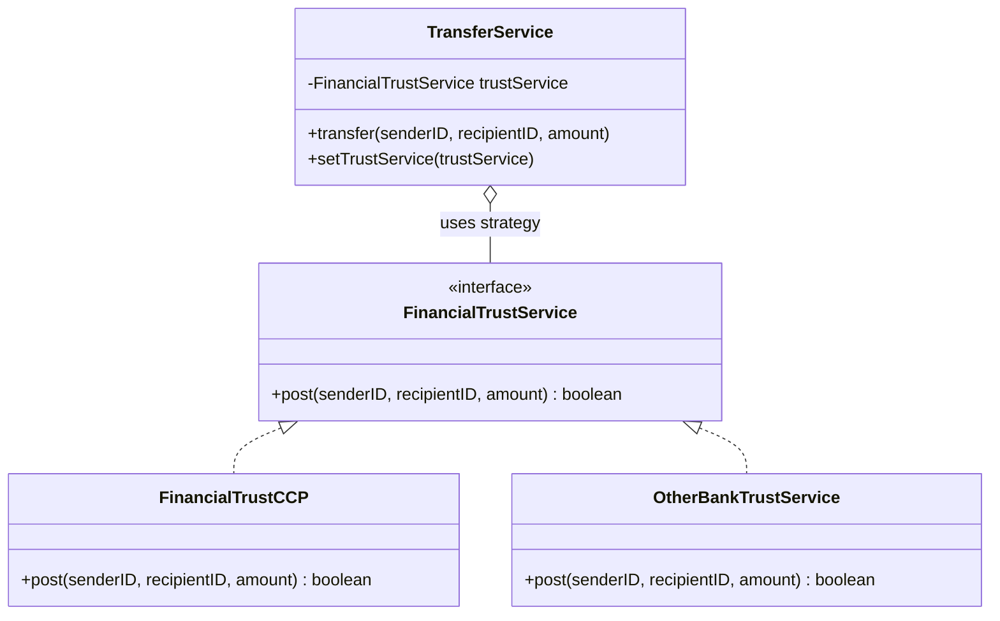

# Exercise 2: Strategy Pattern

## 1. Disadvantage of the Proposed Refactoring
The code proposed initially uses **Inheritance** (Factory Method) to manage different service implementations:

```java
protected FinancialTrustService createFinacialTrustService(){
    return new FinancialTrustCCP();
}
```

### Disadvantages:
- **Tightly Coupled**: The `transfertService` is still dependent on subclassing to change the behavior.
- **Static Change**: The choice of service is decided at instantiation time (or fixed in a subclass).
- **Class Explosion**: If we have many banks, we need a subclass for each bank's transfer service.
- **No Runtime Flexibility**: We cannot switch services at runtime for the same instance.

## 2. Proposed Solution: Strategy Pattern
The **Strategy Pattern** (with Dependency Injection) is the ideal solution.

### Explanation:
By defining a `FinancialTrustService` interface and injecting it into the `TransferService`, we decouple the transfer logic from the specific financial provider. This allows the bank to:
- Pass any certified service implementation at runtime.
- Switch between services dynamically without inheriting or modifying existing code.
- Adhere to the **Open/Closed Principle**.

### UML Class Diagram (Mermaid)


---

## 3. Implementation
The implementation demonstrates how `TransferService` can use different strategies (`FinancialTrustCCP` or `OtherBankTrustService`).

### How to Run
```bash
# Compile and run manually (if mvn is not available)
javac -d target/classes src/main/java/com/esi/designpatterns/*.java
java -cp target/classes com.esi.designpatterns.Main
```
