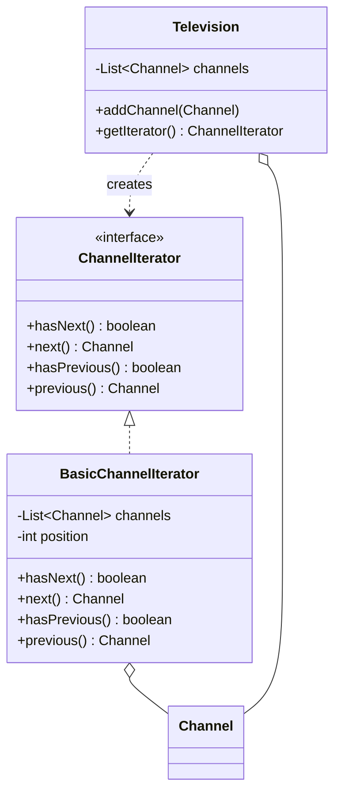

# Exercise 2: TV Remote Navigation

## 1. Design Pattern(s) Used
I used the **Iterator Pattern**.

### Justification
The problem requires navigating through a collection of channels without exposing the internal representation (the underlying list or array of channels).
- **Encapsulation**: The remote control (Client) doesn't need to know if the TV stores channels in an `ArrayList`, `Map`, or linked list. It just interacts with the `Iterator`.
- **Bidirectional Navigation**: The `ChannelIterator` interface supports both `next()` and `previous()` operations, matching the requirements of a modern remote control.
- **Uniform Access**: This allows adding new navigation logic (e.g., jumping between favorite channels) by creating different iterator implementations without changing the `Television` class.

## 2. UML Class Diagram (Mermaid)


---

## 3. Implementation
The solution provides a way to navigate channels sequentially in both directions.

### How to Run
```bash
javac -d target/classes src/main/java/com/esi/designpatterns/*.java
java -cp target/classes com.esi.designpatterns.Main
```
