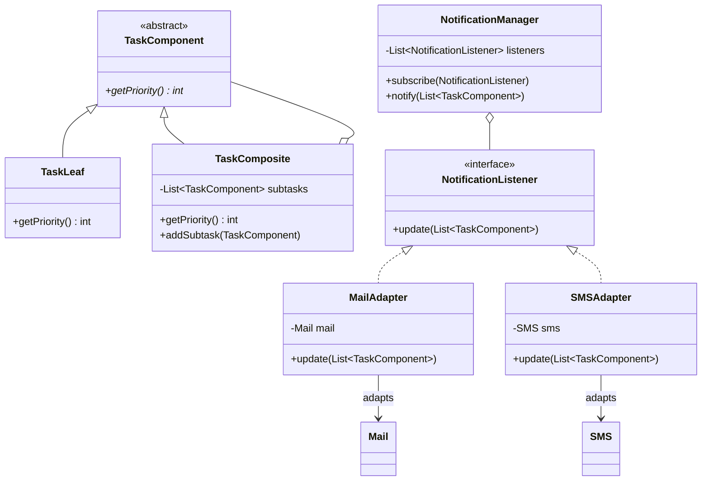

# Exercise 3: Composite, Observer, and Adapter

This exercise demonstrates the integration of three GoF patterns to build a robust task management and notification system.

## 1. Task Modeling: Composite Pattern
We use the **Composite Pattern** to model tasks and subtasks uniformly.

- **Component**: `TaskComponent`
- **Leaf**: `TaskLeaf`
- **Composite**: `TaskComposite`

### Priority Calculation
The priority of a composite task is the rounded average of its subtasks: `(int) Math.round(sum / size)`.

## 2. Notification System: Observer Pattern
We use the **Observer Pattern** to handle notifications.

- **Subject**: `NotificationManager`
- **Observer (Interface)**: `NotificationListener`
- **Concrete Observers**: `MailAdapter`, `SMSAdapter`

This allows us to easily add new notification channels (e.g., WhatsApp, Push) without modifying the `NotificationManager`.

## 3. Legacy Integration: Adapter Pattern
We use the **Adapter Pattern** to reuse the existing `Mail` and `SMS` classes which have incompatible method signatures.

- **Target**: `NotificationListener`
- **Adaptee**: `Mail` / `SMS`
- **Adapter**: `MailAdapter` / `SMSAdapter`

### UML Class Diagram (Mermaid)


---

## How to Run
```bash
javac -d target/classes src/main/java/com/esi/designpatterns/*.java
java -cp target/classes com.esi.designpatterns.Main
```
