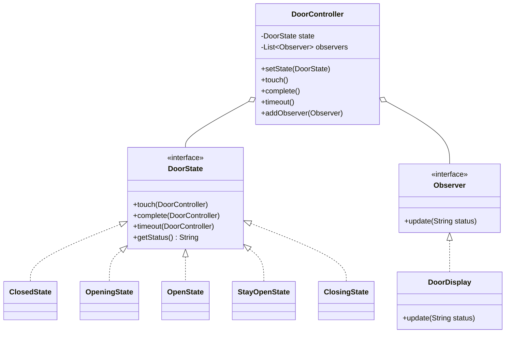

# Exercise 3: Carousel Door Controller

## 1. Design Patterns Used
I used the **State Pattern** and the **Observer Pattern**.

### Justification
- **State Pattern**: The door's behavior is complex and depends entirely on its current state (e.g., `touch` means "Opening" if closed, but "Closing" if opening). Using a state machine avoids messy `if-else` or `switch` blocks and makes the transitions explicit.
- **Observer Pattern**: The requirement states that the display is updated every time the door changes state. The `DoorController` acts as a **Subject** that notifies the `DoorDisplay` (**Observer**) of every state transition, ensuring a decoupled way to update the UI.

## 2. UML Class Diagram & Correspondence

### Correspondence Table
| Pattern Element | Exercise 3 Element |
| :--- | :--- |
| **State** (Interface) | `DoorState` |
| **Concrete State** | `ClosedState`, `OpeningState`, `OpenState`, `StayOpenState`, `ClosingState` |
| **Context** | `DoorController` |
| **Subject** | `DoorController` |
| **Observer** | `Observer` (Interface) |
| **Concrete Observer** | `DoorDisplay` |

### UML Diagram (Mermaid)


---

## 3. Implementation
The solution carefully tracks state transitions and uses a `Timer` to simulate the automatic closing behavior after 2 seconds.

### How to Run
```bash
javac -d target/classes src/main/java/com/esi/designpatterns/*.java
java -cp target/classes com.esi.designpatterns.Main
```
