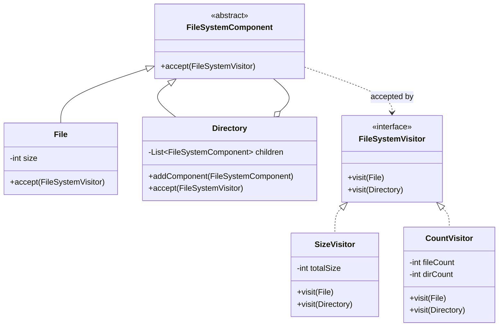

# Exercise 4: File System Hierarchy

## 1. Design Patterns Used
I used the **Composite Pattern** and the **Visitor Pattern**.

### Justification
- **Composite Pattern**: The problem describes a hierarchical structure where directories can contain both files and other sub-directories. The Composite pattern allows us to treat a single `File` and a complex `Directory` uniformly as `FileSystemComponent`.
- **Visitor Pattern**: The requirement asks for two separate calculations (size and count) that should be implemented with minimal modification to the hierarchical classes. The Visitor pattern allows us to add new operations (like `SizeVisitor` or `CountVisitor`) without polluting the `File` or `Directory` classes with business logic.

## 2. UML Class Diagram & Correspondence

### Correspondence Table
| Pattern Element | Exercise 4 Element |
| :--- | :--- |
| **Component** | `FileSystemComponent` |
| **Leaf** | `File` |
| **Composite** | `Directory` |
| **Visitor** (Interface) | `FileSystemVisitor` |
| **Concrete Visitor** | `SizeVisitor`, `CountVisitor` |

### UML Diagram (Mermaid)


---

## 3. Implementation
The implementation uses `accept()` and `visit()` methods to perform double dispatch, allowing specialized logic to be applied to each node type during a single traversal.

### How to Run
```bash
javac -d target/classes src/main/java/com/esi/designpatterns/*.java
java -cp target/classes com.esi.designpatterns.Main
```
