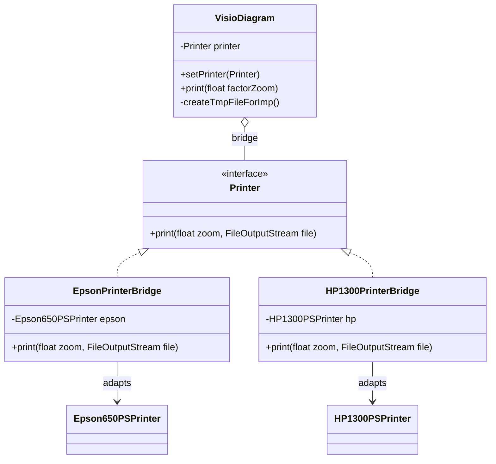

# Exercise 4: Bridge Pattern

## 1. Design Pattern Suitable
The **Bridge Pattern** is the most suitable because it decouples an abstraction (`VisioDiagram`) from its implementation (`Printer`), allowing both to vary independently.

### Why?
- **Decoupling**: The diagram doesn't need to know the specific printer model selected.
- **Handling Different APIs**: The printers have different method signatures (Zoomfactor vs fZoomX/Y). The Bridge implementations act as adapters to provide a uniform interface.
- **Extensibility**: Adding a new printer only requires creating a new concrete implementation of the `Printer` interface.

## 2. UML Class Diagram & Correspondence

### Correspondence Table
| Pattern Element | Exercise 4 Element |
| :--- | :--- |
| **Abstraction** | `VisioDiagram` |
| **Implementor** | `Printer` (Interface) |
| **ConcreteImplementor** | `EpsonPrinterBridge`, `HP1300PrinterBridge`, etc. |
| **RefinedAbstraction** | (Optional, not needed here as `VisioDiagram` is simple) |

### UML Diagram (Mermaid)


---

## 3. Implementation
The solution provides a uniform `Printer` interface that `VisioDiagram` uses. The concrete classes bridge the gap between this uniform interface and the specific (mocked) third-party printer APIs.

### How to Run
```bash
javac -d target/classes src/main/java/com/esi/designpatterns/*.java
java -cp target/classes com.esi.designpatterns.Main
```
