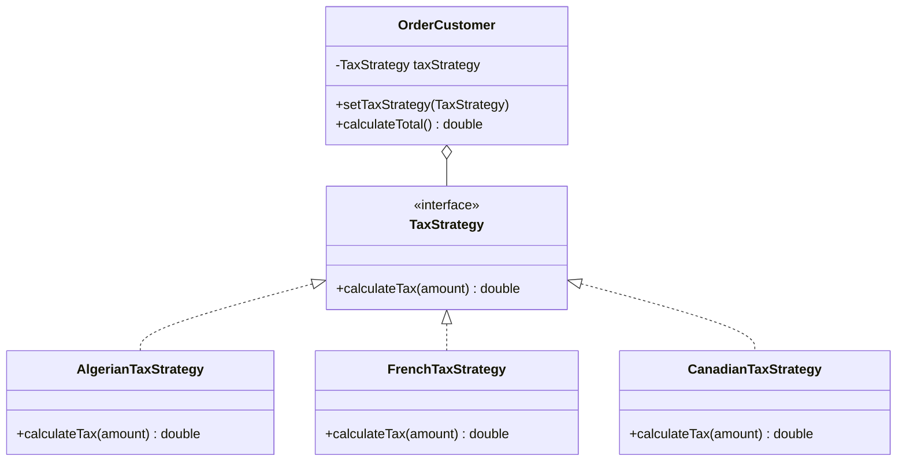

# Exercise 5: Tax Calculation Strategy

## 1. Design Solution Proposed
Identify and encapsulate **what varies**: the tax calculation rules (which depend on the country).

Instead of using a bulky `switch` or `if-else` block inside the `OrderCustomer` class, we move each country's tax logic into its own class that implements a common interface.

## 2. Design Pattern Involved
I used the **Strategy Pattern**.

### Justification
- **Encapsulation of Algorithms**: Each tax rule is an "algorithm" for calculating tax. The Strategy pattern allows these algorithms to be interchangeable.
- **Open/Closed Principle**: We can add support for a new country (e.g., USA, UK) by simply adding a new class without modifying the `OrderCustomer` class.
- **Runtime Flexibility**: The tax strategy can be set or changed at runtime based on the order's origin.

## 3. UML Class Diagram & Correspondence

### Correspondence Table
| Pattern Element | Exercise 5 Element |
| :--- | :--- |
| **Strategy** (Interface) | `TaxStrategy` |
| **Concrete Strategy** | `AlgerianTaxStrategy`, `FrenchTaxStrategy`, `CanadianTaxStrategy` |
| **Context** | `OrderCustomer` |

### UML Diagram (Mermaid)


---

## 4. Implementation
The solution demonstrates how `OrderCustomer` delegates the responsibility of tax calculation to the injected `TaxStrategy`.

### How to Run
```bash
javac -d target/classes src/main/java/com/esi/designpatterns/*.java
java -cp target/classes com.esi.designpatterns.Main
```
