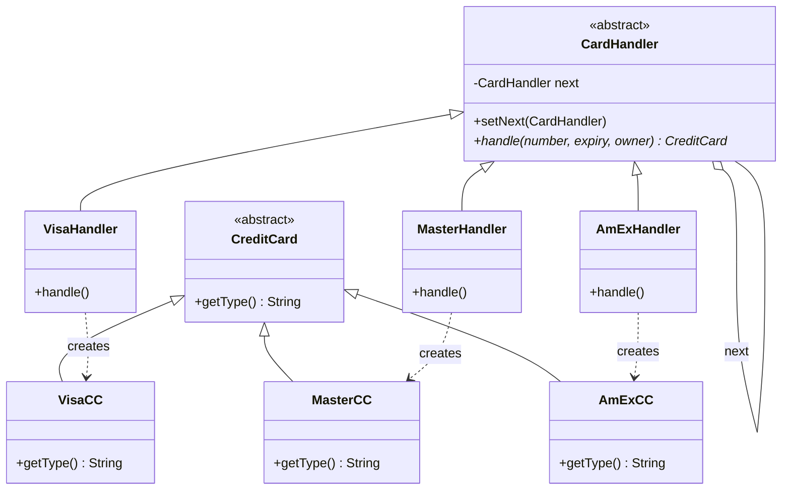

# Exercise 6: Credit Card Identification

## 1. Description of Problems
- **Main Problem**: Identifying the type of a credit card from its number and dynamically creating the correct subclass instance.
- **Secondary Problem**: Each card has specific and varying validation rules (length, prefixes). Hardcoding these in a single class leads to rigid, hard-to-maintain code.

## 2. Design Pattern(s) Used
I used the **Chain of Responsibility Pattern** and **Factory Method** (via the chain).

### Justification
- **Chain of Responsibility**: Instead of a giant `if-else` block, each card type has its own `Handler`. The request (card identification) passes through the chain until a handler recognizes the format. This decouples the client from the validation logic.
- **Extensibility**: To support new card types (e.g., Discover, JCB), we just need to create a new `Handler` and add it to the chain without modifying existing handlers.

## 3. UML Class Diagram & Correspondence

### Correspondence Table
| Pattern Element | Exercise 6 Element |
| :--- | :--- |
| **Handler** (Abstract) | `CardHandler` |
| **Concrete Handler** | `VisaHandler`, `MasterHandler`, `AmExHandler` |
| **Product** | `CreditCard` |
| **Concrete Product** | `VisaCC`, `MasterCC`, `AmExCC` |

### UML Diagram (Mermaid)


---

## 4. Implementation
The solution provides a robust way to parse card data and instantiate the correct objects via a chain of specialized validators.

### How to Run
```bash
javac -d target/classes src/main/java/com/esi/designpatterns/*.java
java -cp target/classes com.esi.designpatterns.Main
```
