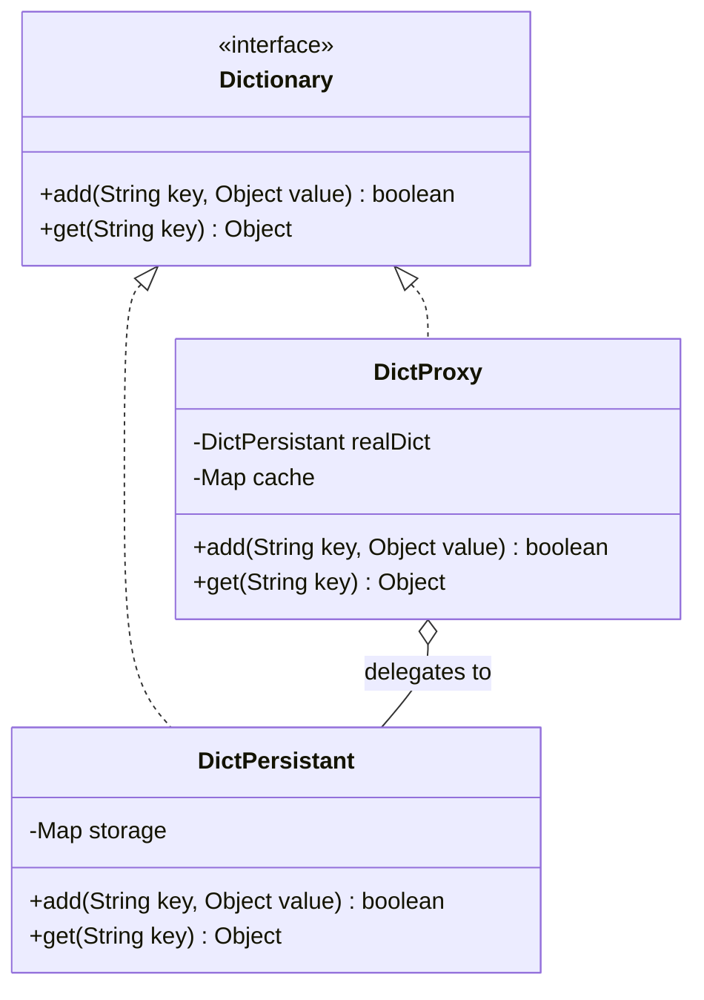

# Exercise 7: Proxy Pattern (Caching)

## 1. Design Pattern Identification
The **Proxy Pattern** is used to implement a caching mechanism.

### Why?
By providing a placeholder or surrogate (`DictProxy`) for the real persistent dictionary (`DictPersistant`), we can control access to it. The proxy checks if the requested object is already in memory before triggering an expensive disk read operation.

## 2. UML Class Diagram & Correspondence

### Correspondence Table
| Pattern Element | Exercise 7 Element | Role in Situation |
| :--- | :--- | :--- |
| **Subject** | `Dictionary` (Interface) | Defines common interface for RealSubject and Proxy. |
| **RealSubject** | `DictPersistant` | The expensive resource that reads from disk. |
| **Proxy** | `DictProxy` | Intercepts calls to implement caching logic. |
| **Client** | `Main` | Uses the Proxy via the Subject interface. |

### UML Diagram (Mermaid)


---

## 3. Implementation
The solution uses `DictProxy` to intercept `get()` calls. If the key exists in the `cache` map, it returns it immediately. Otherwise, it delegates to `DictPersistant`, which simulates a disk read, and then caches the result for future calls.

### How to Run
```bash
javac -d target/classes src/main/java/com/esi/designpatterns/*.java
java -cp target/classes com.esi.designpatterns.Main
```
