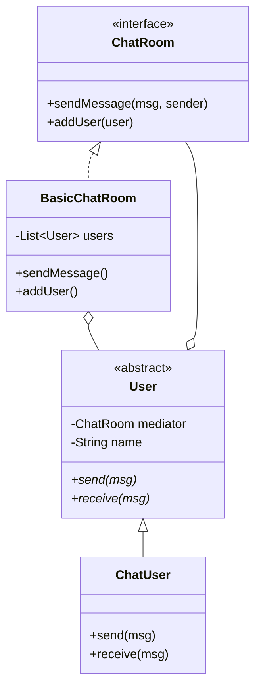

# Exercise 7: Chat Room Mediator

## 1. Design Pattern Used
I used the **Mediator Pattern**.

### Justification
The problem requires users to communicate with each other in an instant messaging tool. 
- **Centralization**: Instead of each user having a reference to every other user (which would create $O(n^2)$ connections), they all communicate with a central `ChatRoom`.
- **Decoupling**: Users don't know about each other. They only know about the Mediator. This makes it easy to add or remove users without updating any existing `User` code.
- **Control**: The `ChatRoom` can easily implement specific logic (e.g., filtering messages, blocking users, logging) in one place.

## 2. UML Class Diagram & Correspondence

### Correspondence Table
| Pattern Element | Exercise 7 Element |
| :--- | :--- |
| **Mediator** (Interface) | `ChatRoom` |
| **Concrete Mediator** | `BasicChatRoom` |
| **Colleague** (Abstract) | `User` |
| **Concrete Colleague** | `ChatUser` |

### UML Diagram (Mermaid)


---

## 3. Implementation
The solution provides a central `BasicChatRoom` that manages message broadcasting between users.

### How to Run
```bash
javac -d target/classes src/main/java/com/esi/designpatterns/*.java
java -cp target/classes com.esi.designpatterns.Main
```
