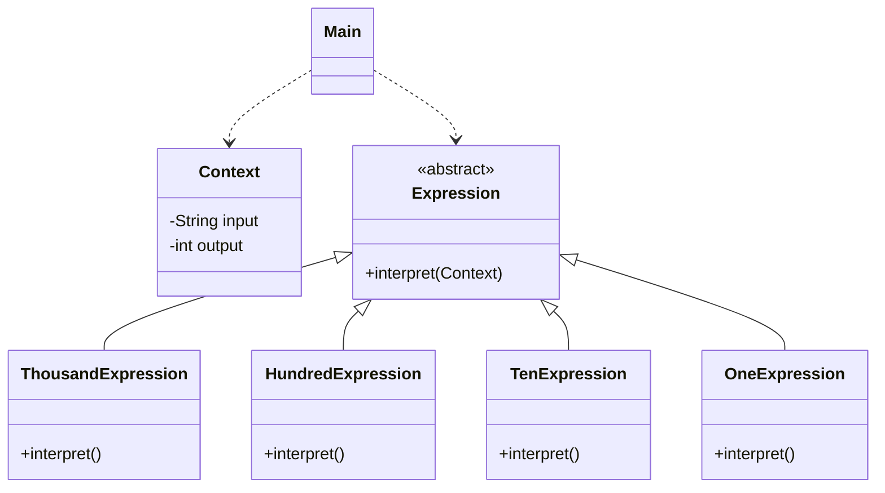

# Exercise 8: Roman Numeral Interpreter

## 1. Proposed Grammar
To facilitate the interpretation of Roman numbers, we define a grammar that decodes the number by magnitude (Thousands -> Hundreds -> Tens -> Units).

### EBNF Grammar
```text
Letter ::= I | V | X | L | C | D | M
Number ::= Thousands? Hundreds? Tens? Units?
Thousands ::= 'M' | 'MM' | 'MMM'
Hundreds ::= 'C' | 'CC' | 'CCC' | 'CD' | 'D' | 'DC' | 'DCC' | 'DCCC' | 'CM'
Tens ::= 'X' | 'XX' | 'XXX' | 'XL' | 'L' | 'LX' | 'LXX' | 'LXXX' | 'XC'
Units ::= 'I' | 'II' | 'III' | 'IV' | 'V' | 'VI' | 'VII' | 'VIII' | 'IX'
```

## 2. Design Pattern Used
I used the **Interpreter Pattern**.

### Justification
The problem requires translating a language (Roman numerals) into a value.
- **Recursive Structure**: The grammar is simple and hierarchical, which maps perfectly to a tree of expressions.
- **Ease of Implementation**: By breaking down the problem into different Terminal Expressions (Thousands, Hundreds, etc.), we can parse the string in a single pass from left to right.
- **Extensibility**: If we wanted to add support for larger symbols (like bar-notated numbers for millions), we would just add a new `Expression` subclass.

## 3. UML Class Diagram & Correspondence

### Correspondence Table
| Pattern Element | Exercise 8 Element |
| :--- | :--- |
| **Abstract Expression** | `Expression` |
| **Terminal Expression** | `ThousandExpression`, `HundredExpression`, etc. |
| **Context** | `Context` |
| **Client** | `Main` |

### UML Diagram (Mermaid)


---

## 4. Implementation
The solution uses a series of expressions to gradually consume the input string and build the total decimal value.

### How to Run
```bash
javac -d target/classes src/main/java/com/esi/designpatterns/*.java
java -cp target/classes com.esi.designpatterns.Main
```
