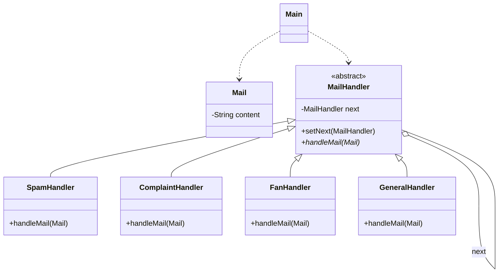

# Exercise 9: Automatic Mail Sorting

## 1. Design Pattern Used
I used the **Chain of Responsibility Pattern**.

## 2. Pattern Correspondence
- **Handler**: `MailHandler` (Interface/Abstract class defining the handling protocol).
- **Concrete Handlers**: `SpamHandler`, `ComplaintHandler`, `FanHandler`, `GeneralHandler` (Classes implementing specific sorting logic).
- **Request**: `Mail` (The object being passed through the chain).
- **Client**: `Main` (The entity that initiates the request to the head of the chain).

### Justification
The problem requires sorting mail based on its content into different categories. 
- **Decoupling**: The sender of the mail (or the system receiving it) doesn't need to know which department will handle it.
- **Sequential Filtering**: The chain allows checking for "Spam" first, then "Complaints", then "Fan mail", and finally falling back to "General" mail if no specific keywords match.
- **Maintainability**: If a new department (e.g., "Human Resources") needs to handle specific emails, we just add a new handler to the chain.

## 3. UML Class Diagram & Correspondence

### UML Diagram (Mermaid)


---

## 4. Implementation
The solution provides an automated pipeline where keywords guide the destination of each mail item.

### How to Run
```bash
javac -d target/classes src/main/java/com/esi/designpatterns/*.java
java -cp target/classes com.esi.designpatterns.Main
```
